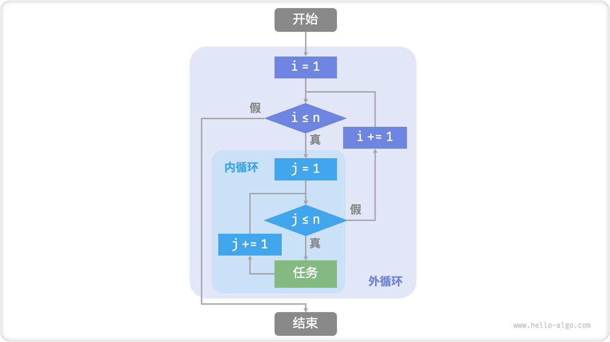
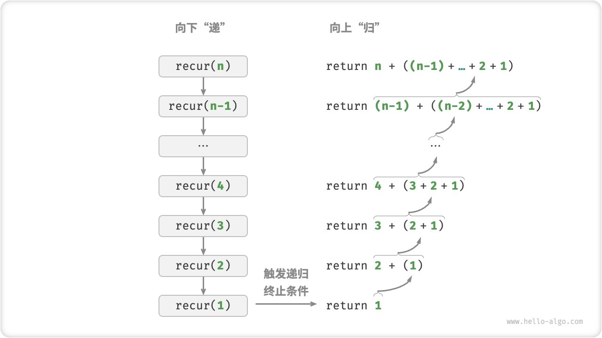
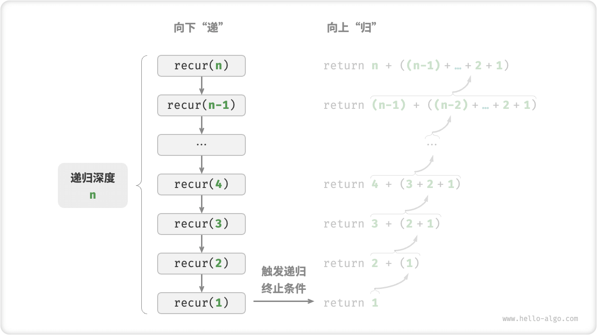
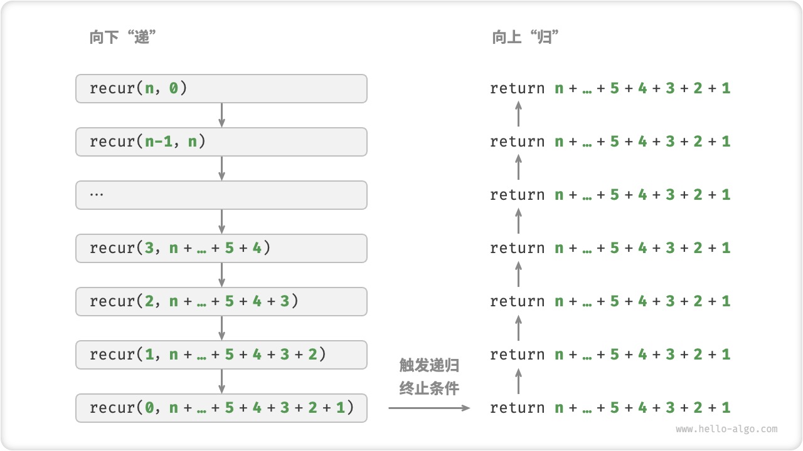

# Iteration and Recursion

In algorithms, repeatedly performing a task is common and closely related to complexity analysis. Therefore, before introducing time complexity and space complexity, let's first understand how to implement task repetition in programs, focusing on two basic programming control structures: iteration and recursion.

## Iteration

"Iteration" is a control structure for repeatedly performing a task. In iteration, a program repeats a block of code as long as a certain condition is met, until this condition is no longer satisfied.

### for Loop

The `for` loop is one of the most common forms of iteration, **suitable for use when the number of iterations is known in advance**.

The following function implements the sum $1 + 2 + \dots + n$ using a `for` loop, with the sum result recorded in the variable `res`. Note that in Python, `range(a, b)` corresponds to a "left-closed, right-open" interval, covering $a, a + 1, \dots, b-1$:

```src
[file]{iteration}-[class]{}-[func]{for_loop}
```

The flowchart below represents this sum function.


The number of operations in this sum function is proportional to the input data size $n$, or in other words, it has a "linear relationship". This is actually what **time complexity describes**. This topic will be detailed in the next section.

### while Loop

Similar to the `for` loop, the `while` loop is another method to implement iteration. In a `while` loop, the program checks the condition in each round; if the condition is true, it continues, otherwise, the loop ends.

Below we use a `while` loop to implement the sum $1 + 2 + \dots + n$:

```src
[file]{iteration}-[class]{}-[func]{while_loop}
```

**The `while` loop is more flexible than the `for` loop**. In a `while` loop, we can freely design the initialization and update steps of the condition variable.

For example, in the following code, the condition variable $i$ is updated twice in each round, which would be inconvenient to implement with a `for` loop:

```src
[file]{iteration}-[class]{}-[func]{while_loop_ii}
```

Overall, **`for` loops are more concise, while `while` loops are more flexible**. Both can implement iterative structures. Which one to use should be determined based on the specific requirements of the problem.

### Nested Loops

We can nest one loop structure within another. Below is an example using `for` loops:

```src
[file]{iteration}-[class]{}-[func]{nested_for_loop}
```

The flowchart below represents this nested loop.



In this case, the number of operations in the function is proportional to $n^2$, or the algorithm's running time and the input data size $n$ have a "quadratic relationship".

We can continue adding nested loops, each nesting is a "dimensional escalation," which will increase the time complexity to "cubic," "quartic," and so on.

## Recursion

"Recursion" is an algorithmic strategy that solves problems by having a function call itself. It mainly consists of two phases.

1. **Recursion**: The program continuously calls itself, usually with smaller or more simplified parameters, until reaching a "termination condition."
2. **Return**: Upon triggering the "termination condition," the program begins to return from the deepest recursive function, aggregating the results of each layer.

From an implementation perspective, recursive code mainly includes three elements.

1. **Termination Condition**: Determines when to switch from "recursion" to "return."
2. **Recursive Call**: Corresponds to "recursion," where the function calls itself, usually with smaller or more simplified parameters.
3. **Return Result**: Corresponds to "return," where the result of the current recursion level is returned to the previous layer.

Observe the following code, where calling the function `recur(n)` completes the computation of $1 + 2 + \dots + n$:

```src
[file]{recursion}-[class]{}-[func]{recur}
```

The figure below shows the recursive process of this function.



Although iteration and recursion can achieve the same results from a computational standpoint, **they represent two entirely different paradigms of thinking and solving problems**.

- **Iteration**: Solves problems "from the bottom up." It starts with the most basic steps, then repeatedly adds or accumulates these steps until the task is complete.
- **Recursion**: Solves problems "from the top down." It breaks down the original problem into smaller sub-problems, each of which has the same form as the original problem. These sub-problems are then further decomposed into even smaller sub-problems, stopping at the base case (whose solution is known).

Taking the sum function as an example, let's define the problem as $f(n) = 1 + 2 + \dots + n$.

- **Iteration**: In a loop, simulate the summing process, iterating from $1$ to $n$, performing the sum operation in each round, to obtain $f(n)$.
- **Recursion**: Break down the problem into sub-problems $f(n) = n + f(n-1)$, continuously (recursively) decomposing until reaching the base case $f(1) = 1$ and then stopping.

### Call Stack

Each time a recursive function calls itself, the system allocates memory for the newly initiated function to store local variables, call addresses, and other information. This leads to two main consequences.

- The function's context data is stored in a memory area called "stack frame space" and is only released after the function returns. Therefore, **recursion generally consumes more memory space than iteration**.
- Recursive calls introduce additional overhead. **Hence, recursion is usually less time-efficient than loops**.

As shown in the figure below, there are $n$ unreturned recursive functions before triggering the termination condition, indicating a **recursion depth of $n$**.



In practice, the depth of recursion allowed by programming languages is usually limited, and excessively deep recursion can lead to stack overflow errors.

### Tail Recursion

Interestingly, **if a function makes its recursive call as the last step before returning**, it can be optimized by compilers or interpreters to be as space-efficient as iteration. This scenario is known as "tail recursion".

- **Regular Recursion**: The function needs to perform more code after returning to the previous level, so the system needs to save the context of the previous call.
- **Tail Recursion**: The recursive call is the last operation before the function returns, meaning no further actions are required upon returning to the previous level, so the system doesn't need to save the context of the previous level's function.

For example, in calculating $1 + 2 + \dots + n$, we can make the result variable `res` a parameter of the function, thereby achieving tail recursion:

```src
[file]{recursion}-[class]{}-[func]{tail_recur}
```

The execution process of tail recursion is shown in the following figure. Comparing regular recursion and tail recursion, the point of the summation operation is different.

- **Regular Recursion**: The summation operation occurs during the "return" phase, requiring another summation after each layer returns.
- **Tail Recursion**: The summation operation occurs during the "recursion" phase, and the "return" phase only involves returning through each layer.



!!! tip

    Note that many compilers or interpreters do not support tail recursion optimization. For example, Python does not support tail recursion optimization by default, so even if the function is in the form of tail recursion, it may still encounter stack overflow issues.

### Recursion Tree

When dealing with algorithms related to "divide and conquer", recursion often offers a more intuitive approach and more readable code than iteration. Take the "Fibonacci sequence" as an example.

!!! question

    Given a Fibonacci sequence $0, 1, 1, 2, 3, 5, 8, 13, \dots$, find the $n$th number in the sequence.

Let the $n$th number of the Fibonacci sequence be $f(n)$, it's easy to deduce two conclusions:

- The first two numbers of the sequence are $f(1) = 0$ and $f(2) = 1$.
- Each number in the sequence is the sum of the two preceding ones, that is, $f(n) = f(n - 1) + f(n - 2)$.

Using the recursive relation, and considering the first two numbers as termination conditions, we can write the recursive code. Calling `fib(n)` will yield the $n$th number of the Fibonacci sequence:

```src
[file]{recursion}-[class]{}-[func]{fib}
```

Observing the above code, we see that it recursively calls two functions within itself, **meaning that one call generates two branching calls**. As illustrated below, this continuous recursive calling eventually creates a "recursion tree" with a depth of $n$.


Fundamentally, recursion embodies the paradigm of "breaking down a problem into smaller sub-problems." This divide-and-conquer strategy is crucial.

- From an algorithmic perspective, many important strategies like searching, sorting, backtracking, divide-and-conquer, and dynamic programming directly or indirectly use this way of thinking.
- From a data structure perspective, recursion is naturally suited for dealing with linked lists, trees, and graphs, as they are well suited for analysis using the divide-and-conquer approach.

## Comparison

Summarizing the above content, the following table shows the differences between iteration and recursion in terms of implementation, performance, and applicability.

<p align="center"> Table: Comparison of Iteration and Recursion Characteristics </p>

|                   | Iteration                                                   | Recursion                                                                                                                        |
| ----------------- | ----------------------------------------------------------- | -------------------------------------------------------------------------------------------------------------------------------- |
| Approach          | Loop structure                                              | Function calls itself                                                                                                            |
| Time Efficiency   | Generally higher efficiency, no function call overhead      | Each function call generates overhead                                                                                            |
| Memory Usage      | Typically uses a fixed size of memory space                 | Accumulative function calls can use a substantial amount of stack frame space                                                    |
| Suitable Problems | Suitable for simple loop tasks, intuitive and readable code | Suitable for problem decomposition, like trees, graphs, divide-and-conquer, backtracking, etc., concise and clear code structure |

!!! tip

    If you find the following content difficult to understand, consider revisiting it after reading the "Stack" chapter.

So, what is the intrinsic connection between iteration and recursion? Taking the above recursive function as an example, the summation operation occurs during the recursion's "return" phase. This means that the initially called function is actually the last to complete its summation operation, **mirroring the "last in, first out" principle of a stack**.

In fact, recursive terms like "call stack" and "stack frame space" hint at the close relationship between recursion and stacks.

1. **Recursion**: When a function is called, the system allocates a new stack frame on the "call stack" for that function, storing local variables, parameters, return addresses, and other data.
2. **Return**: When a function completes execution and returns, the corresponding stack frame is removed from the "call stack," restoring the execution environment of the previous function.

Therefore, **we can use an explicit stack to simulate the behavior of the call stack**, thus transforming recursion into an iterative form:

```src
[file]{recursion}-[class]{}-[func]{for_loop_recur}
```

Observing the above code, when recursion is transformed into iteration, the code becomes more complex. Although iteration and recursion can often be transformed into each other, it's not always advisable to do so for two reasons:

- The transformed code may become harder to understand and less readable.
- For some complex problems, simulating the behavior of the system's call stack can be quite challenging.

In summary, **choosing between iteration and recursion depends on the nature of the specific problem**. In programming practice, weighing the pros and cons of each and choosing the appropriate method for the situation is essential.
